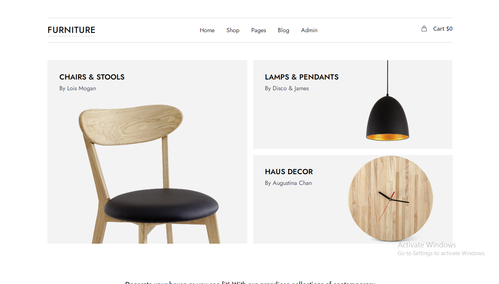

# __Furniture Website__
##### Design inspiration credits to [Eskil](https://eskil.qodeinteractive.com/)

## __Disclaimer__
Project is still in development

---


It's a beautifully crafted mini E-commerce site for furnitures.



## __Getting Started__
This project was built using __[Vite](https://vitejs.dev/guide/)__ (for faster development), __[React.JS](https://react.dev/learn/installation)__ and __[TailwindCSS](https://tailwindcss.com/)__.
Project also uses firebase for backend __[Firebase](https://firebase.google.com/)

### __Pages__
* / => Homepage
* /cart => Cart page
* /checkout => Checkout page
* /signup => Sign up page
* /login => Log in page
* /admin => Admin page

#### Installation process
After cloning the repo, install the neccessary dependencies

```bash
npm install
# or
yarn install
```

After installation, you view in development mode using

```bash
npm run dev
# or
yarn run dev
```

You are now good to go